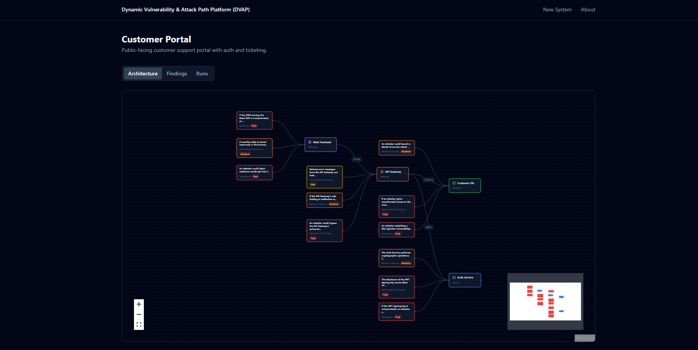
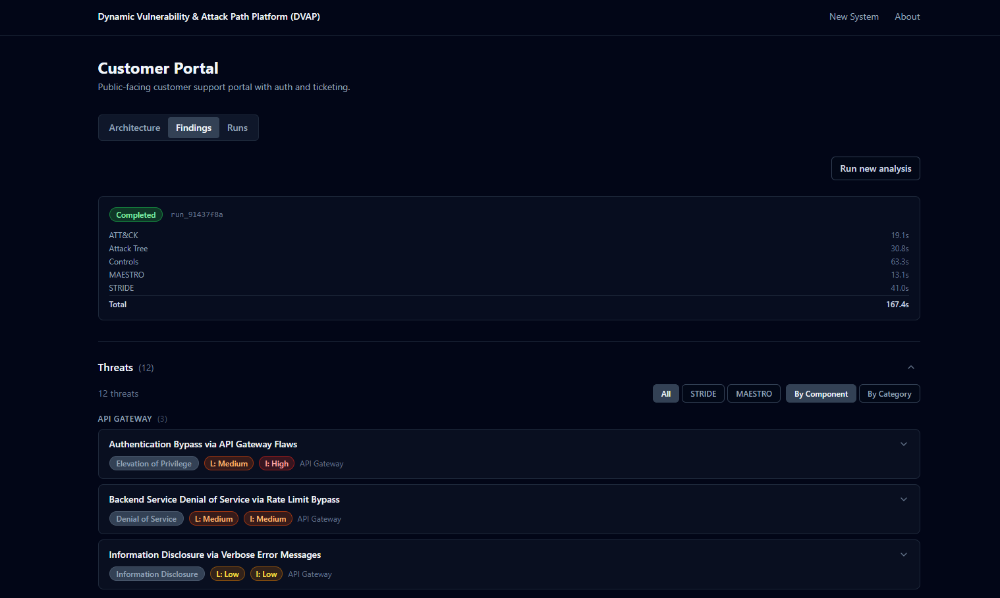
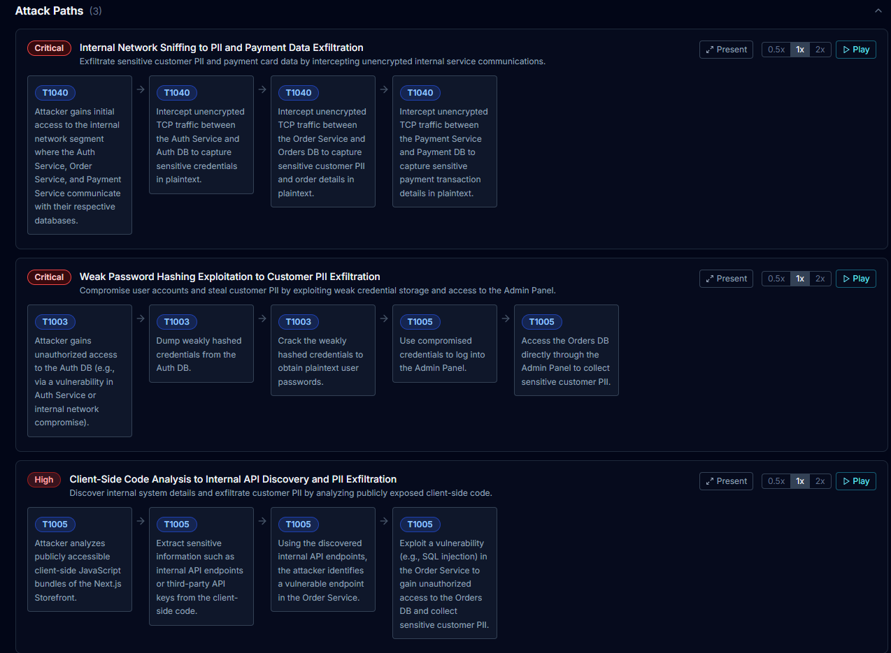
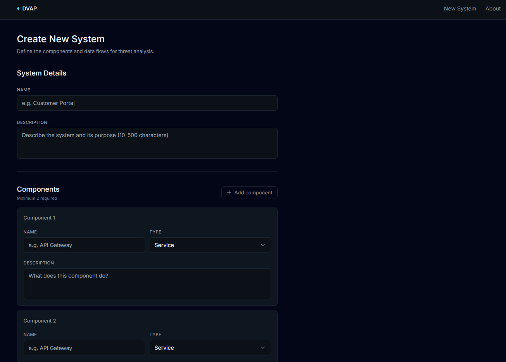

# Dynamic Vulnerability & Attack Path Platform (DVAP)



[](LICENSE)
[](ARCHITECTURE.md)
[](#project-status)

> AI Security Copilot for Architects. Multi-agent threat modeling
> with grounded ATT&CK mapping and CIS controls.

---

## What DVAP does

Traditional threat modeling is slow, manual, and inconsistent. Practitioners draw data flow
diagrams by hand, walk STRIDE categories one by one, and produce reports that grow stale
the moment the architecture changes. A moderately complex system can take days to review,
and output quality depends heavily on the individual reviewer's expertise and familiarity
with MITRE ATT&CK.

DVAP automates that workflow. You describe your system once (components, types, and data
flows), click Run Analysis, and five specialist AI agents produce a complete threat model:
a STRIDE threat catalog, MITRE ATT&CK technique mappings, attack chains through the
component graph, and prioritized CIS control recommendations. STRIDE and MAESTRO run in
parallel; the remaining three agents run sequentially, each consuming the output of the
previous one. A complete run typically completes in two to three minutes.

What makes the output trustworthy: every ATT&CK technique ID in the mappings is validated
against a locally seeded Neo4j graph of 697 real techniques. Agents cannot hallucinate
technique IDs that do not exist in the database. All agent outputs are persisted in SQLite
with full timing data for auditability. The architecture graph is rendered interactively in
the browser so you can explore components, threats, and attack paths visually.

DVAP augments experienced security architects; it does not replace them. The tool surfaces
candidates and maps them to reference data. A human reviewer is still responsible for
prioritizing findings, validating relevance, and deciding on remediation. The goal is to
eliminate the manual grunt work so architects can focus on judgment rather than research.

---

## Quickstart

**Prerequisites:** Docker Desktop with Compose V2, and a free Google AI Studio API key
from [aistudio.google.com](https://aistudio.google.com/).

**1. Clone and configure:**

```bash
git clone git@github.com:beproy/dvap.git
cd dvap
cp .env.example .env
# Edit .env and set GOOGLE_API_KEY to your actual key
```

**2. Start all containers:**

```bash
docker compose up -d
```

**3. Wait for all three containers to report healthy:**

```bash
docker compose ps
# dvap-backend, dvap-neo4j, and dvap-frontend should all show "healthy"
# Neo4j takes about 30-40 seconds on first start
```

**4. Seed the reference data (one-time setup, takes 3-5 minutes):**

```bash
docker compose exec backend python scripts/seed_attack.py
docker compose exec backend python scripts/seed_controls.py
```

`seed_attack.py` downloads the MITRE ATT&CK STIX bundle (approximately 100 MB) and imports
697 techniques into Neo4j. The file is cached locally; subsequent runs are fast.

**5. Install frontend dependencies (required after first start or after `docker compose down -v`):**

```bash
docker compose exec frontend npm install
docker compose restart frontend
```

**6. Optional: load a demo system with a pre-run analysis:**

```bash
docker compose exec backend python scripts/seed_demo.py
```

This creates the "Acme Customer Portal" example system and runs a full analysis on it, so
you immediately see what DVAP produces instead of starting from an empty state.

**7. Open the app:**

[http://localhost:3000](http://localhost:3000)

The API explorer is available at [http://localhost:8000/docs](http://localhost:8000/docs).

> **Reset note:** if you run `docker compose down -v`, the `-v` flag deletes all Docker
> volumes including the one holding `node_modules`. Re-run steps 4 and 5 after any
> full volume reset.

---

## Screenshots

### Architecture view with threats


The React Flow canvas shows system components (nodes with type icons) and the threats
generated by the analysis (smaller nodes fanning outward). Edges show data flows with
protocol labels.

### Threat findings



The findings page groups output into four sections: threat catalog (STRIDE and MAESTRO),
ATT&CK technique mappings (grounded in Neo4j), attack path chains, and CIS control
recommendations.

### Attack path visualization



Each attack path shows the sequence of ATT&CK techniques an attacker would chain together
to reach a target component, with tactic labels at each step.

### Creating a system



The system creation form accepts a name, description, one or more components (with type and
description), and data flows between components. Validation runs inline before submission.

---

## Tech Stack

| Layer | Technology |
|---|---|
| Frontend | Next.js 14, React Flow, TailwindCSS, shadcn/ui |
| Backend | FastAPI, LangGraph 0.2, Python 3.12 |
| Graph DB | Neo4j Community Edition 5.20 |
| Audit DB | SQLite |
| LLM | Google Gemini 2.5 Flash |
| Orchestration | Docker Compose |

---

## How it works

You submit a system description to the API. The LangGraph orchestrator fans out to the
STRIDE and MAESTRO agents in parallel, waits for both to finish, then runs the ATT&CK
agent (which validates technique IDs against Neo4j), followed by the Attack Tree agent
(which builds attack chains in the graph), and finally the Controls agent (which maps
findings to CIS remediation guidance). Results are persisted to both Neo4j (for graph
queries and visualization) and SQLite (for the audit trail). The frontend polls for
completion and renders the full findings set when the run status reaches "completed."

See [ARCHITECTURE.md](ARCHITECTURE.md) for details on the component architecture, agent
pipeline, data layer, and how to extend the system.

---

## Project status

**v1.0.0 - feature complete. Looking for feedback and contributors.**

Known limitations:

- ATT&CK mapping coverage is partial. Roughly 50-75% of threats receive technique
  mappings depending on the system; threats with no reasonable match are reported in the
  `unmapped_threats` field.
- Free-tier Gemini rate limits apply. A concurrency semaphore caps parallel LLM calls
  at 2 to reduce 429 errors, but analysis may slow or fail under heavy load on the free
  tier.
- The CIS Controls v8 dataset is a hand-curated subset of 18 controls. Broader coverage
  is a future milestone.

---

## Roadmap

- Local Ollama backend for fully air-gapped operation
- Additional LLM providers (OpenAI, Anthropic)
- Expanded CIS Controls dataset
- Optional cloud deployment guide

---

## Contributing

See [CONTRIBUTING.md](CONTRIBUTING.md).

---

## License

MIT. See [LICENSE](LICENSE).

---

## Acknowledgments

Built with significant assistance from AI coding tools, including Anthropic's Claude.

