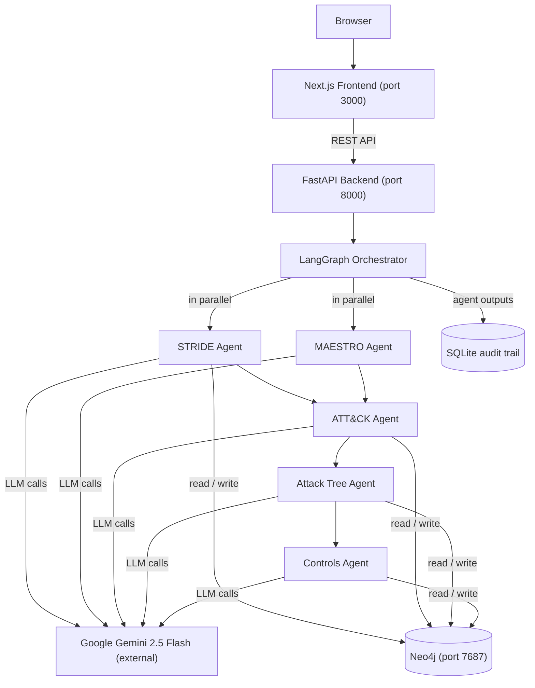

# DVAP 2.0

AI Security Copilot for Architects. Multi-agent threat modeling with grounded ATT&CK mapping and CIS controls.

[](LICENSE)
[](https://fastapi.tiangolo.com)
[](#project-status)

---

## What is DVAP?

Traditional threat modeling is slow, manual, and inconsistent. Practitioners draw data flow diagrams, walk STRIDE categories by hand, and produce reports that grow stale the moment the architecture changes. The process typically takes days for a moderately complex system, and output quality depends heavily on individual reviewer expertise.

DVAP 2.0 automates the analyst's workflow. You describe your system (components, types, and data flows), submit it to the API, and five specialist AI agents produce: a STRIDE threat catalog, MITRE ATT&CK technique mappings, attack paths through the graph, and prioritized CIS/NIST control recommendations. STRIDE and MAESTRO run in parallel; the remaining three agents run sequentially, each consuming the previous output. A complete analysis typically takes 2 to 3 minutes.

What makes the output trustworthy: every ATT&CK technique ID in the mappings and attack paths is validated against a locally seeded Neo4j graph of 697 real techniques. Agents cannot produce technique IDs that do not exist in the database. All agent outputs are stored in SQLite with full timing data for auditability. The LLM backend (Google Gemini 2.5 Flash) is abstracted behind an interface, so alternative backends can be added without touching the agent layer.

---

## Architecture



---

## Tech Stack

| Layer | Technology |
|---|---|
| Frontend | Next.js 14 + React Flow + TailwindCSS |
| Backend | FastAPI + LangGraph 0.2 |
| Graph DB | Neo4j Community Edition 5.20 |
| Audit trail | SQLite |
| LLM | Google Gemini 2.5 Flash |
| Orchestration | Docker Compose |

---

## Quickstart

**Prerequisites:**
- Docker Desktop with Compose V2
- A Google AI Studio API key (free tier works): https://aistudio.google.com/

**1. Clone and configure:**

```bash
git clone git@github.com:beproy/dvap.git
cd dvap
cp .env.example .env
# Open .env and set GOOGLE_API_KEY to your actual key
```

**2. Start all containers:**

```bash
docker compose up -d
```

Wait for all three containers (dvap-backend, dvap-neo4j, dvap-frontend) to report healthy:

```bash
docker compose ps
```

**3. Seed the reference data (one-time setup):**

```bash
docker compose exec backend python scripts/seed_attack.py
docker compose exec backend python scripts/seed_controls.py
```

Note: `seed_attack.py` downloads the MITRE ATT&CK STIX bundle from GitHub (approximately 100 MB) and imports 697 techniques into Neo4j. This takes 3 to 5 minutes on first run. The file is cached locally; subsequent runs are fast.

**Then:**
- API explorer: http://localhost:8000/docs
- Frontend: http://localhost:3000 (placeholder while Phase 5 is in progress)

---

## Example Usage

The full analysis workflow involves two API calls: registering a system, then starting an analysis run.

### Step 1: Register a system

```bash
curl -s -X POST http://localhost:8000/api/systems \
  -H "Content-Type: application/json" \
  -d '{
    "name": "Customer Portal",
    "description": "Public-facing customer support portal with auth and ticketing.",
    "components": [
      {"name": "Web Frontend",  "type": "web_app",  "description": "React SPA served via CDN"},
      {"name": "API Gateway",   "type": "gateway",  "description": "Routes and authenticates incoming requests"},
      {"name": "Auth Service",  "type": "service",  "description": "JWT issuance and validation"},
      {"name": "Customer DB",   "type": "database", "description": "PostgreSQL holding customer records and tickets"}
    ],
    "data_flows": [
      {"source": "Web Frontend", "destination": "API Gateway",  "data_type": "JSON over HTTPS",        "protocol": "HTTPS",   "is_encrypted": true},
      {"source": "API Gateway",  "destination": "Auth Service", "data_type": "JWT validation requests", "protocol": "gRPC",    "is_encrypted": true},
      {"source": "API Gateway",  "destination": "Customer DB",  "data_type": "SQL queries",             "protocol": "TCP/TLS", "is_encrypted": true}
    ]
  }'
```

Response (201 Created):

```json
{
  "system_id": "sys_8f3a2b1c",
  "name": "Customer Portal",
  "component_count": 4,
  "flow_count": 3,
  "created_at": "2026-06-11T09:00:00Z"
}
```

### Step 2: Start an analysis run

```bash
curl -s -X POST http://localhost:8000/api/systems/sys_8f3a2b1c/analyze \
  -H "Content-Type: application/json" \
  -d '{"agents": ["stride", "maestro", "attack", "attack_tree", "controls"]}'
```

Response (202 Accepted):

```json
{
  "run_id": "run_9d4e1f2a",
  "system_id": "sys_8f3a2b1c",
  "status": "pending",
  "started_at": "2026-06-11T09:00:05Z",
  "estimated_seconds": 120
}
```

### Step 3: Poll for completion, then fetch findings

```bash
# Check status (typically completes in 2 to 3 minutes)
curl -s http://localhost:8000/api/analyses/run_9d4e1f2a

# Fetch full findings once status is "completed"
curl -s http://localhost:8000/api/analyses/run_9d4e1f2a/findings
```

Findings response shape:

```json
{
  "run_id": "run_9d4e1f2a",
  "status": "completed",
  "threats": ["..."],
  "technique_mappings": ["..."],
  "attack_paths": ["..."],
  "control_recommendations": ["..."],
  "timings": {"stride": 25.0, "attack": 34.6, "attack_tree": 23.0, "controls": 33.3},
  "errors": []
}
```

A real run on the Customer Portal example produces approximately 11 threats, 6 ATT&CK technique mappings, 4 attack paths, and 8 control recommendations.

---

## Project Status

**Backend: complete (Phase 4 of 6).** All five agents are implemented, tested, and running in Docker. The REST API is stable. Phase 4 acceptance tests all pass, including two concurrent analysis runs completing without errors.

**Frontend: in progress (Phase 5).** The Next.js scaffold is in place but the React Flow graph visualization, system registration form, and findings display are not yet built.

**Known limitations:**

- ATT&CK mapping coverage is partial (roughly 50 to 75 percent of threats receive technique mappings, depending on the system). Threats with no reasonable match are reported in the `unmapped_threats` field.
- Free-tier Gemini rate limits apply. A global semaphore caps concurrent LLM calls at two to avoid 429 errors under load.
- The CIS Controls v8 dataset is a hand-curated subset of 18 controls. Broader coverage is a future milestone.

---

## Roadmap

- **Phase 5:** React Flow visualization, system registration form, findings display
- **Phase 6:** GitHub Actions CI (lint, type-check, backend tests on push)
- **Future (optional):** Local Ollama backend for fully air-gapped operation

---

## Contributing

Contributions are welcome. To get started, follow the Quickstart above to set up a local development environment, then read [CONTRIBUTING.md](CONTRIBUTING.md) for code style, testing requirements, and pull request expectations.

---

## License

MIT, see [LICENSE](LICENSE).
